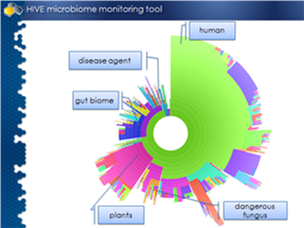
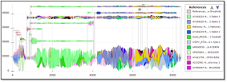
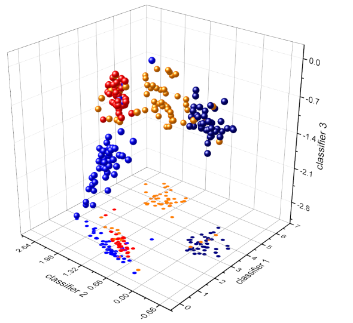

 

## FDA launches HIVE Open Source: a platform to support end to end needs for NGS analytics

We are happy to announce the Open Source launch of the High-performance Integrated Virtual Environment (**HIVE**),
a modern robust suite of software that provides an infrastructure for next-generation sequence (NGS)
data analysis co-developed by Food and Drug Administration and George Washington University. The HIVE provides
a distributed data retrieval system, archival capabilities, and computational environment architected to manipulate
NGS data. This heterogeneous multicomponent set of software can operate in a private or public cloud infrastructure
providing web portal access for registered users to securely retrieve, to deposit, to annotate, to compute on NGS
data, and to analyze the outcomes using scientific visualizations.  The HIVE was constructed in collaboration with
research and regulatory scientists.

### HIVE capabilities

- **Data-retrieval:** the HIVE is capable of retrieving data from variety of sources such as local, cloud-based
or network storage, from sequencing instruments, and from http, ftp and sftp repositories. Additionally,
HIVE implements the sophisticated handshake protocols with existing large scale data platforms such as
NIH/NCBI to easily and verifiably download large amounts of reference genomic or sequence read data on
behalf of users.

- **Computations:** Unlike many virtual computing environments, HIVE virtualizes services, not processes:
it provides computations as a service by introducing agnostic abstraction layer between hardware, software
and the computational tasks requested by users. The novel paradigm of relocating computations closer to the
data, instead of moving data to computing cores has proven to be the key for optimal flow of tasks and data
through network infrastructure.

- **Data-warehousing:** HIVE honeycomb data model was specifically created for adopting complex hierarchy
of scientific datatypes providing a platform for standardization and provenance of data within the framework
of object-oriented data models. By using an integrated data-engine, honeycomb, HIVE contributes to the
veracity of biomedical computations and helps ensure reproducibility, and harmonization of bio-computational processes.

- **Security:** HIVE-honeycomb employs a hierarchical security control system, allowing determination of access
privileges in an acutely granular manner without overwhelming the security subsystem with a multiplicity of rules.

- **Integration:** HIVE provides unified Application Program Interface (API) to search, edit, view, secure,
share and manipulate data and computations of all types.  As an Integrator platform HIVE provides developers
means to develop (C/C++, Python, Perl, JavaScript, R) and integrate existing almost any open source or
commercial tools using generic adaptation framework to integrate command line tools. Additionally web-API
provides means to drive HIVE to perform data quality control and complex computations on behalf of remote users.

- **Visualization:** HIVE provides number of scientific visualization components using technologies as HTML5,
SVG, D3JS within its Data Driven Document context. The native data and metadata and computational results provided
in JSON, CSV-based communication protocols, which are used to generate interactive, user driven, customizable
tools allow bioinformaticians to manipulate terabytes of extra-large data using only an Internet browser.

This release of the HIVE software is aligned with the President’s call for “Leveraging American Ingenuity through
Reusable and Open Source Software.” We strongly believe that a platform like HIVE which was created and operated
by a government organization driven by regulatory science and by academia whose research activities are in support
of public health should be accessible and available for public use. The goals of making this release of the HIVE
as open source platform include:  
- Use of this platform by industry and academic scientists in support of the President’s Personalized Medicine Initiative;
- Allow industry and academics to use analytics and computation methodologies similar to those used by FDA;
- Provide a foundation for better communication and collaboration with data and computational results using biocompute paradigm.

HIVE was developed as collaboration between scientific doctors Vahan Simonyan, and Raja Mazumder. Four years ago HIVE
codebase was donated to US government in order to build a platform ready to accept NGS data at the US FDA for regulatory
review. Since then the HIVE Team has built a significant number of new tools and integrated new features. The HIVE has
supported research leading to tens of peer review publications in genetics, genomics, proteomics, data modeling, and
bioinformatics. This history of sharing through the publication of results is culminated in today’s announcement of
the release of software under MIT style Open Source license. We intentionally used the most open dissemination method
and most open style licensing agreement in order to avoid any artificial limitations to use this software by anyone who
wants to benefit the healthcare of humans and to apply this for a great many scientific and technological challenges. It
is with greatest pleasure and recognition of the work of many dedicated and talented scientists and developers that today
I am sharing this platform with you.  

Vahan Simonyan,  
PhD, Physics and Mathematics  
Lead Scientist, HIVE Project Director,  
Center for Biologics Evaluation and Research,  
Food and Drug Administration

#### Source repository
  GitHub (https://github.com/FDA/fda-hive) is the location of HIVE open source codebase.

#### The MIT Open Source License

Copyright(C) 2016 U.S. Food and Drug Administration  
Authors: Dr. Vahan Simonyan (1), Dr. Raja Mazumder (2)  
Affiliation: Food and Drug Administration (1), George Washington University (2)  

Citation: Vahan Simonyan and Raja Mazumder, High-Performance Integrated Virtual Environment (HIVE)
Tools and Applications for Big Data Analysis. Genes (Basel).
2014 Sep 30; 5(4):957-81. PMID: [25271953](http://www.ncbi.nlm.nih.gov/pubmed/25271953)

All rights Reserved.  
  Permission is hereby granted, free of charge, to any person obtaining a copy of this software and associated
  documentation files (the "Software"), to deal in the Software without restriction, including without limitation
  the rights to use, copy, modify, merge, publish, distribute, sublicense, and/or sell copies of the Software, and
  to permit persons to whom the Software is furnished to do so, subject to the following conditions:

The above copyright notice and this permission notice shall be included in all copies or substantial portions of the Software.

THE SOFTWARE IS PROVIDED "AS IS", WITHOUT WARRANTY OF ANY KIND, EXPRESS OR IMPLIED, INCLUDING BUT NOT LIMITED TO
THE WARRANTIES OF MERCHANTABILITY, FITNESS FOR A PARTICULAR PURPOSE AND NONINFRINGEMENT. IN NO EVENT SHALL THE AUTHORS
OR COPYRIGHT HOLDERS BE LIABLE FOR ANY CLAIM, DAMAGES OR OTHER LIABILITY, WHETHER IN AN ACTION OF CONTRACT, TORT OR OTHERWISE,
ARISING FROM, OUT OF OR IN CONNECTION WITH THE SOFTWARE OR THE USE OR OTHER DEALINGS IN THE SOFTWARE.

#### Scientific Publication references

- High-performance integrated virtual environment (HIVE): a robust infrastructure for next-generation
  sequence data analysis. http://www.ncbi.nlm.nih.gov/pubmed/26989153
- FDA's Activities Supporting Regulatory Application of "Next Gen" Sequencing Technologies.
  http://www.ncbi.nlm.nih.gov/pubmed/25475637
- High-Performance Integrated Virtual Environment (HIVE) Tools and Applications for Big Data Analysis.
  http://www.ncbi.nlm.nih.gov/pubmed/25271953

#### Notes
  **Alterations:** HIVE source code has been slightly modified from its working deployment copy in order to comply
  with security regulations at the FDA: particular implementation of encryption algorithm and configuration management
  information have been stripped off. Analogues are available in the open source media and can be used instead of
  placeholder code references. 

  **Expertise:** HIVE is an enterprise level system and the available documentation in publications needs to be complimented
  with expert software and hardware developers and system administration privileges to deploy, configure and maintain its
  operations. Currently discussions are ongoing on the mechanism to provide outreach through academic partners.

##### *corresponding author: Vahan Simonyan PhD, vahan.simonyan@fda.hhs.gov / vahansim@gmail.com*
